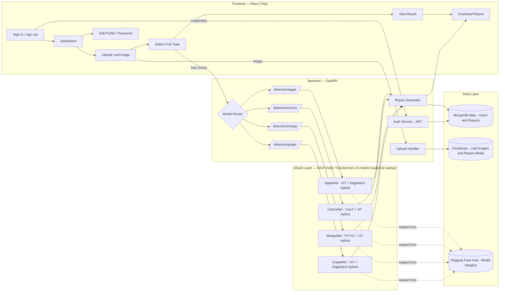
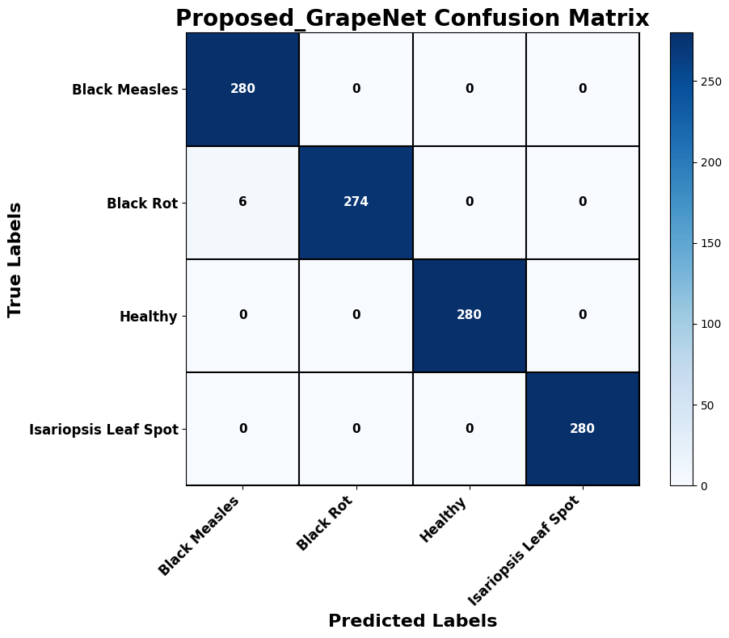
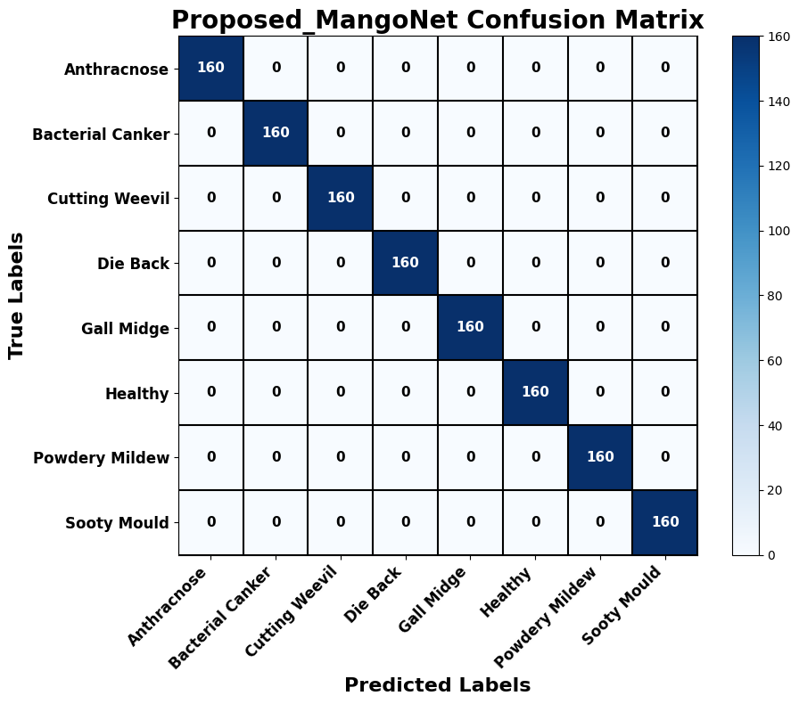
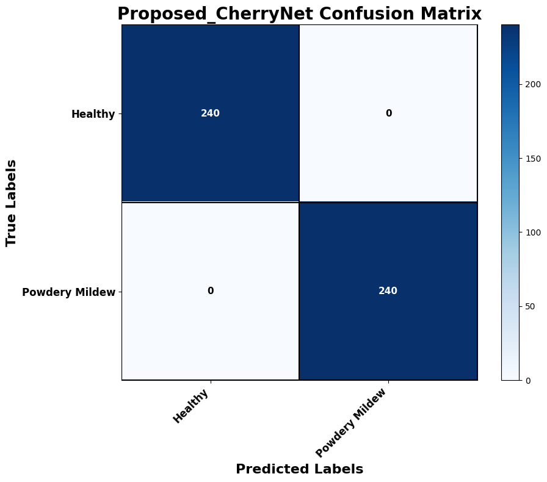
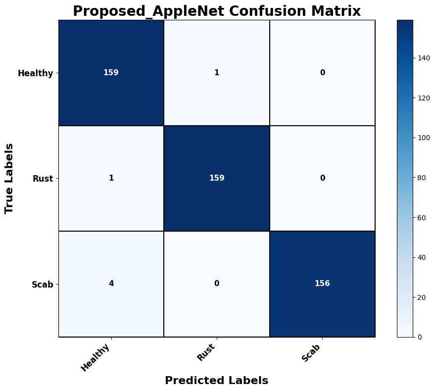

<div align="center">

# 🍃 PlantDx

### Transformer-Powered Fruit Leaf Disease Detection & Classification

*Upload a leaf image. Select the fruit. Get an instant, downloadable diagnostic report.*

[](https://www.python.org/)
[](https://fastapi.tiangolo.com/)
[](https://pytorch.org/)
[](#-research-methodology)
[](https://react.dev/)
[](https://www.mongodb.com/atlas)
[](https://huggingface.co/)
[](https://jwt.io/)

</div>

---

## 📖 Overview

**PlantDx** is a full-stack, deep-learning-powered web application for detecting and classifying diseases in fruit leaves. Users upload a photo of an **apple, cherry, mango, or grape** leaf, and the platform classifies it — identifying whether the leaf is **healthy** or, if diseased, exactly **which disease** it has.

The entire project is built on a **pure Vision Transformer pipeline — no CNNs are used anywhere in the model architecture.** Every backbone, from the initial comparative study through to the final proposed models, is a transformer.

| # | Fruit | Model | Classes |
|---|---|---|---|
| 1 | 🍎 **Apple** | AppleNet (Hybrid ViT) | Disease classes + Healthy |
| 2 | 🍒 **Cherry** | CherryNet (Hybrid ViT) | Disease classes + Healthy |
| 3 | 🥭 **Mango** | MangoNet (Hybrid ViT) | Disease classes + Healthy |
| 4 | 🍇 **Grape** | GrapeNet (Hybrid ViT) | Disease classes + Healthy |

Like the underlying research, this README documents the complete methodology, model performance, system architecture, and deployment of the platform in one place — research paper structure, engineering detail included.

---

## 📑 Table of Contents

- [Overview](#-overview)
- [Key Features](#-key-features)
- [Tech Stack](#-tech-stack)
- [System Architecture](#-system-architecture)
- [Research Methodology](#-research-methodology)
  - [Datasets & References](#1-datasets--references)
  - [Preprocessing](#2-preprocessing)
  - [Data Augmentation](#3-data-augmentation)
  - [Comparative Study — 7 SOTA Transformer Models](#4-comparative-study--7-sota-transformer-models)
  - [Proposed Hybrid Architecture](#5-proposed-hybrid-transformer-architecture)
  - [Training Hyperparameters](#6-training-hyperparameters)
- [Results](#-results)
- [Deployment Architecture](#-deployment-architecture)
  - [Frontend](#-frontend)
  - [Backend](#-backend)
  - [Authentication](#-authentication)
- [API Reference](#-api-reference-indicative)
- [Getting Started](#-getting-started)
- [Environment Variables](#-environment-variables)
- [References](#-references)
- [Future Work](#-future-work)
- [License](#-license)

---

## ✨ Key Features

- 🖼️ **Leaf image upload** — supports apple, cherry, mango, and grape leaf photos.
- 🎯 **Disease classification + healthy detection** — each fruit's model classifies the leaf into its disease classes, or as healthy, in a single pass.
- 🔀 **Model routing** — the correct hybrid transformer model is invoked automatically based on the fruit selected by the user.
- 📄 **Downloadable reports** — every analysis generates a report the user can download for their records.
- 🔐 **Secure authentication** — JWT-based sign up, sign in, and sign out.
- 👤 **Profile management** — users can edit their profile details and change their password.
- ⚡ **Simple, clean interface** — a minimal-friction workflow: upload → select fruit → analyze → download.
- 🧠 **100% Transformer-based** — no convolutional backbones anywhere; every SOTA model and every proposed hybrid model is a Vision Transformer variant.
- 📊 **Research-backed models** — every model is selected after a comparative evaluation of 7 SOTA transformer architectures per fruit.

---

## 🛠 Tech Stack

### Machine Learning / Research
| Category | Tools |
|---|---|
| Model development | **PyTorch**, **timm** (PyTorch Image Models) |
| Transformer backbones | DeiT-Tiny, Swin-Tiny, ViT-Small, CoaT-Lite-Small, PVTv2-B0, MaxViT-Tiny, EdgeNeXt-Small |
| Training compute | **Google Colab (T4 GPU)** |
| Model hosting | **Hugging Face** (trained model weights stored & served from the Hub) |
| Experiment/API testing | **Postman** |

### Backend
| Category | Tools |
|---|---|
| Framework | **Python**, **FastAPI** |
| Inference | **PyTorch + timm** (4 hybrid transformer models loaded in-memory) |
| Authentication | **JWT (JSON Web Tokens)** |
| Database | **MongoDB Atlas** |
| Media storage | **Cloudinary** (leaf images & report assets) |

### Frontend
| Category | Tools |
|---|---|
| Framework | **React (Vite)** |
| State management | **React Redux** |
| Routing | **React Router DOM** |
| Auth flow | Sign in / Sign up / Sign out, protected routes |

---

## 🏗 System Architecture



**Flow summary:** the user authenticates, uploads a leaf image, and selects the fruit type. The backend routes the request to the corresponding detection endpoint, which runs inference using the pre-loaded hybrid transformer model (weights pulled from Hugging Face) for that fruit, stores the scan/report data (MongoDB Atlas + Cloudinary), and returns a result the user can view and download.

---

## 🔬 Research Methodology

The goal of the research phase was to find the strongest possible **transformer-only** model for each of the four fruits — through a structured comparative study followed by a custom hybrid transformer design. No CNN backbones were used at any stage.

**Strategy:**
1. Run a comparative analysis of **7 state-of-the-art Vision Transformer models** (pretrained weights) on each dataset (apple, cherry, mango, grape) under identical hyperparameters.
2. Identify the **top 2 performing transformer backbones** per dataset.
3. Build a **hybrid model** that fuses both backbones with the backbone fully unfrozen, and train it further for stronger performance than either individual model.

### 1. Datasets & References

<details>
<summary><b>🍎 Apple</b></summary>

- **Paper:** ResNet-Transformer Hybrid Model for Classifying Apple Leaf Diseases — [doi.org/10.1016/j.procs.2026.06.583](https://doi.org/10.1016/j.procs.2026.06.583)
- **Dataset:** [Apple Leaf Disease Dataset (Kaggle)](https://www.kaggle.com/datasets/nirmalsankalana/apple-leaf-disease-dataset)

</details>

<details>
<summary><b>🥭 Mango</b></summary>

- **Paper 1:** Mango-Mamba and VN-MangoLeaf — a lightweight Mamba model and new dataset for mango leaf disease classification — [doi.org/10.1016/j.compeleceng.2026.111033](https://doi.org/10.1016/j.compeleceng.2026.111033) · Dataset: [Mendeley Data](https://data.mendeley.com/datasets/hxsnvwty3r/1)
- **Paper 2 (official):** MangoLeafBD — a comprehensive image dataset to classify diseased and healthy mango leaves — [doi.org/10.1016/j.dib.2023.108941](https://doi.org/10.1016/j.dib.2023.108941) · Dataset: [Mendeley Data](https://data.mendeley.com/datasets/hxsnvwty3r/1)

</details>

<details>
<summary><b>🍇 Grape &nbsp;/&nbsp; 🍒 Cherry &nbsp;</b></summary>

- **Paper:** Fruit Leaf Diseases Classification: A Hierarchical Deep Learning Framework — [doi.org/10.32604/cmc.2023.035324](https://doi.org/10.32604/cmc.2023.035324)
- **Dataset:** [PlantVillage Dataset (Kaggle)](https://www.kaggle.com/datasets/abdallahalidev/plantvillage-dataset) — source of the grape and cherry leaf classes used in this project.

</details>

### 2. Preprocessing

Every leaf image, regardless of fruit type, passes through the same normalization pipeline (`torchvision.transforms`) before being fed into a model:

```python
transform = transforms.Compose([
    transforms.Resize((224, 224)),
    transforms.ToTensor(),
    transforms.Normalize(
        mean=[0.485, 0.456, 0.406],
        std=[0.229, 0.224, 0.225]
    )
])
```

All models — SOTA comparison and proposed hybrids alike — operate at a fixed **224×224** input resolution.

### 3. Data Augmentation

Several of the source datasets are **class-imbalanced** (e.g. far more healthy-leaf samples than samples for certain disease classes). To correct this, a **target-size data augmentation strategy** is applied so that every class is brought up to the same target sample count before training. Once each class reaches the target size, augmentation includes:

- **Random horizontal flip**
- **Random vertical flip**
- **Moderate zoom**
- **Moderate rotation**

This balances the effective class distribution the model sees during training, reduces bias toward majority classes, and improves generalization on minority disease classes.

### 4. Comparative Study — 7 SOTA Transformer Models

The following pretrained Vision Transformer backbones (via **timm**) were benchmarked, identically, on **all four datasets**:

`DeiT-Tiny (patch16, 224)` · `Swin-Tiny (patch4, window7, 224)` · `ViT-Small (patch16, 224)` · `CoaT-Lite-Small` · `PVTv2-B0` · `MaxViT-Tiny (tf, 224)` · `EdgeNeXt-Small`

For this comparative phase, each backbone was loaded with pretrained ImageNet weights and **fully frozen**, training only a **global average pooling classifier head**, with:

```python
# ============================================================
# BUILD TRANSFORMER MODEL
# ============================================================
def build_model(model_name: str, num_classes: int) -> nn.Module:
    model = timm.create_model(model_name, pretrained=True, num_classes=num_classes, global_pool="avg")

    for param in model.parameters():
        param.requires_grad = False

    classifier = model.get_classifier()
    if isinstance(classifier, nn.Module):
        for param in classifier.parameters():
            param.requires_grad = True

    model = model.to(device)
    return model
```

### 5. Proposed Hybrid Transformer Architecture

After ranking the 7 SOTA models per dataset, the **top-2 performing transformer backbones for each fruit** were fused into a dual-branch hybrid network. Each branch extracts global-pooled features independently (`num_classes=0`, `global_pool="avg"`), the two feature vectors are concatenated, and a shared classifier head produces the final prediction. Unlike the SOTA comparison phase, the proposed models are trained with the **backbone fully unfrozen** (end-to-end fine-tuning).

The four proposed models — **AppleNet**, **CherryNet**, **MangoNet**, and **GrapeNet** — all follow this same dual-branch transformer design, differing only in which two backbones are fused for that fruit. Below is the reference implementation pattern (ViT-Small + EdgeNeXt-Small, used for AppleNet and GrapeNet):

```python
class HybridModel(nn.Module):
    def __init__(self, num_classes):
        super().__init__()
        self.edgenext = timm.create_model("edgenext_small", pretrained=True, num_classes=0, global_pool="avg")
        self.vit = timm.create_model("vit_small_patch16_224", pretrained=True, num_classes=0, global_pool="avg")

        edgenext_dim = self.edgenext.num_features
        vit_dim = self.vit.num_features
        fusion_dim = edgenext_dim + vit_dim

        self.classifier = nn.Sequential(
            nn.Linear(fusion_dim, 512),
            nn.BatchNorm1d(512),
            nn.ReLU(),
            nn.Dropout(0.4),
            nn.Linear(512, 256),
            nn.BatchNorm1d(256),
            nn.ReLU(),
            nn.Dropout(0.3),
            nn.Linear(256, num_classes)
        )

    def forward(self, x):
        edgenext_features = self.edgenext(x)
        vit_features = self.vit(x)
        fused_features = torch.cat((edgenext_features, vit_features), dim=1)
        return self.classifier(fused_features)


def build_model(num_classes):
    model = HybridModel(num_classes)
    model = model.to(device)
    return model
```

> All preprocessing steps remain identical to the SOTA comparison phase — only the architecture and backbone-freezing policy change, with a bespoke hybrid proposed per fruit (`AppleNet`, `CherryNet`, `MangoNet`, `GrapeNet`), each fusing that dataset's own top-2 transformer backbones.

For the proposed models, optimization uses **AdamW with weight decay** and a **ReduceLROnPlateau** scheduler:

```python
optimizer = torch.optim.AdamW(
    filter(lambda p: p.requires_grad, model.parameters()),
    lr=HP["learning_rate"],
    weight_decay=1e-4
)

scheduler = torch.optim.lr_scheduler.ReduceLROnPlateau(
    optimizer, mode="min", factor=0.2, patience=2, min_lr=1e-6
)
```

### 6. Training Hyperparameters

| Parameter | SOTA Comparative Phase | Proposed Hybrid Phase |
|---|---|---|
| Learning rate | `1e-4` | `1e-4` (with ReduceLROnPlateau) |
| Backbone | Fully frozen | Fully unfrozen (end-to-end fine-tuned) |
| Optimizer | — (classifier head only) | AdamW, `weight_decay=1e-4` |
| Classifier head | Global average pooling | Fusion + Linear/BatchNorm/ReLU/Dropout stack |
| Batch size | 32 | 32 |
| Train / Val / Test split | 70% / 10% / 20% | 70% / 10% / 20% |
| Epochs | 10 (all fruits) | 10 (Grape, Mango, Cherry) · 20 (Apple) |

---

## 📊 Results

Every proposed hybrid transformer **substantially outperforms** every individual SOTA transformer it was built from — pushing test accuracy above **0.98** for three of the four fruits, and reducing test loss by an order of magnitude in every case.

### 🍇 Grape Leaf Dataset (10 epochs)

| Model | Test Accuracy | Test Loss |
|---|---|---|
| CoaT-Lite-Small | 0.9589 | 0.3182 |
| DeiT-Tiny | 0.9125 | 0.6884 |
| PVTv2-B0 | 0.9661 | 0.2043 |
| Swin-Tiny | 0.9670 | 0.2344 |
| **ViT-Small** | 0.9812 | 0.2455 |
| MaxViT-Tiny | 0.9536 | 0.2395 |
| **EdgeNeXt-Small** | 0.9696 | 0.2876 |
| **Proposed GrapeNet (ViT-Small + EdgeNeXt-Small Hybrid)** | **0.9946** | **0.0362** |

<p align="center"><br><sub>Proposed GrapeNet — confusion matrix</sub></p>

---

### 🥭 Mango Leaf Dataset (10 epochs)

| Model | Test Accuracy | Test Loss |
|---|---|---|
| CoaT-Lite-Small | 0.9258 | 0.4672 |
| DeiT-Tiny | 0.8383 | 1.1086 |
| **PVTv2-B0** | 0.9766 | 0.3014 |
| Swin-Tiny | 0.9313 | 0.3711 |
| **ViT-Small** | 0.9734 | 0.2392 |
| MaxViT-Tiny | 0.9578 | 0.3670 |
| EdgeNeXt-Small | 0.9508 | 0.3759 |
| **Proposed MangoNet (PVTv2-B0 + ViT-Small Hybrid)** | **1.0000** | **0.0263** |

<p align="center"><br><sub>Proposed MangoNet — confusion matrix</sub></p>

---

### 🍒 Cherry Leaf Dataset (10 epochs)

| Model | Test Accuracy | Test Loss |
|---|---|---|
| **CoaT-Lite-Small** | 0.9979 | 0.2575 |
| DeiT-Tiny | 0.9833 | 0.4313 |
| PVTv2-B0 | 0.9896 | 0.2770 |
| Swin-Tiny | 0.9938 | 0.1966 |
| **ViT-Small** | 1.0000 | 0.1508 |
| MaxViT-Tiny | 0.9854 | 0.1152 |
| EdgeNeXt-Small | 0.9875 | 0.2686 |
| **Proposed CherryNet (CoaT-Lite-Small + ViT-Small Hybrid)** | **1.0000** | **0.0095** |

<p align="center"><br><sub>Proposed CherryNet — confusion matrix</sub></p>

---

### 🍎 Apple Leaf Dataset (10 epochs SOTA · 20 epochs Proposed)

| Model | Test Accuracy | Test Loss |
|---|---|---|
| CoaT-Lite-Small | 0.7063 | 0.8281 |
| DeiT-Tiny | 0.6708 | 0.9455 |
| PVTv2-B0 | 0.7896 | 0.7395 |
| Swin-Tiny | 0.7667 | 0.7138 |
| **ViT-Small** | 0.8521 | 0.5698 |
| MaxViT-Tiny | 0.7896 | 0.7241 |
| **EdgeNeXt-Small** | 0.7937 | 0.7853 |
| **Proposed AppleNet (ViT-Small + EdgeNeXt-Small Hybrid)** | **0.9875** | **0.0440** |

<p align="center"><br><sub>Proposed AppleNet — confusion matrix</sub></p>

---

## 🚀 Deployment Architecture

PlantDx ships the research above as a two-tier web application: a **React (Vite)** frontend and a **FastAPI** backend serving four independently-loaded transformer models.

### 🎨 Frontend

Built with **React + Vite**, using **Redux** for global state and **React Router DOM** for navigation.

- **Authentication** — Sign up, sign in, and sign out flows, backed by JWT.
- **Profile management** — users can edit their profile information and change their password.
- **Upload** — drag-and-drop or file-picker upload for leaf images.
- **Fruit selection** — the user picks the relevant fruit (apple / cherry / mango / grape) before analysis.
- **Results view** — displays the disease classification (or healthy verdict) returned by the backend.
- **Report download** — users can download a report of their analysis for their own records.

### ⚙️ Backend

Built with **FastAPI**, exposing a set of REST endpoints and holding **four transformer models loaded in memory** at startup (weights pulled from **Hugging Face**) for low-latency inference.

- When a user submits a leaf image with a selected fruit type, the backend routes the request to the corresponding detection endpoint:
  - `detection/apple` → **AppleNet**
  - `detection/cherry` → **CherryNet**
  - `detection/mango` → **MangoNet**
  - `detection/grape` → **GrapeNet**
- Each endpoint runs inference using its dedicated hybrid transformer model and returns the predicted class (a specific disease, or healthy), which is then persisted and made available for report generation.
- **MongoDB Atlas** stores user accounts, scan metadata, and report records.
- **Cloudinary** stores and serves the uploaded leaf images and generated report assets.
- **Hugging Face** hosts and serves the four trained model weight files, pulled by the backend at startup/inference time.

### 🔐 Authentication

Authentication and session handling are implemented using **JWT (JSON Web Tokens)**:

- On login, the backend issues a signed JWT containing the user's identity.
- The token is attached to subsequent requests (upload, detection, profile, report download) to authorize the user.
- Protected frontend routes check for a valid token before granting access to the dashboard, upload, and report features.
- Sign out clears the token client-side, ending the session.

---

## 🔌 API Reference (indicative)

> Endpoint names below reflect the routing scheme described above — adjust prefixes/paths to match your actual FastAPI router setup.

| Method | Endpoint | Description | Auth |
|---|---|---|---|
| `POST` | `/api/auth/signup` | Register a new user | ❌ |
| `POST` | `/api/auth/login` | Authenticate and receive a JWT | ❌ |
| `POST` | `/api/auth/logout` | Sign out / invalidate session | ✅ |
| `GET` | `/api/user/profile` | Get current user's profile | ✅ |
| `PUT` | `/api/user/profile` | Edit profile details | ✅ |
| `PUT` | `/api/user/password` | Change password | ✅ |
| `POST` | `/api/scan/upload` | Upload a leaf image (stored via Cloudinary) | ✅ |
| `POST` | `/detection/apple` | Run apple leaf classification (AppleNet) | ✅ |
| `POST` | `/detection/cherry` | Run cherry leaf classification (CherryNet) | ✅ |
| `POST` | `/detection/mango` | Run mango leaf classification (MangoNet) | ✅ |
| `POST` | `/detection/grape` | Run grape leaf classification (GrapeNet) | ✅ |

---

## 🏁 Getting Started

### Prerequisites

- Node.js 18+ and npm/yarn
- Python 3.10+
- A MongoDB Atlas connection string
- A Cloudinary account (API key/secret)
- A Hugging Face account/token (for pulling model weights)

### Backend Setup

```bash
cd backend
python -m venv venv
source venv/bin/activate        # Windows: venv\Scripts\activate
pip install -r requirements.txt

# model weights (apple, cherry, mango, grape) are pulled from Hugging Face at startup

uvicorn main:app --reload --port 8000
```

### Frontend Setup

```bash
cd frontend
npm install
npm run dev
```

The frontend (Vite dev server) will run on `http://localhost:5173` and communicate with the FastAPI backend on `http://localhost:8000`.

---

## 🔑 Environment Variables

**Backend (`.env`)**

```env
MONGODB_URI=
MONGODB_DATABASE=

CLOUDINARY_CLOUD_NAME=
CLOUDINARY_API_KEY=
CLOUDINARY_API_SECRET=

JWT_SECRET_KEY=
JWT_ALGORITHM=
JWT_EXPIRE_DAYS=

SMTP_HOST=
SMTP_PORT=
SMTP_USERNAME=
SMTP_PASSWORD=
SMTP_FROM_EMAIL=

HF_TOKEN=
HF_REPO_ID=
```

**Frontend (`.env`)**

```env
BACKEND_URL=
```

---


## 📚 References

1. ResNet-Transformer Hybrid Model for Classifying Apple Leaf Diseases — [doi.org/10.1016/j.procs.2026.06.583](https://doi.org/10.1016/j.procs.2026.06.583)
2. Mango-Mamba and VN-MangoLeaf: A lightweight Mamba model and new dataset for mango leaf disease classification — [doi.org/10.1016/j.compeleceng.2026.111033](https://doi.org/10.1016/j.compeleceng.2026.111033)
3. MangoLeafBD: A comprehensive image dataset to classify diseased and healthy mango leaves — [doi.org/10.1016/j.dib.2023.108941](https://doi.org/10.1016/j.dib.2023.108941)
4. Fruit Leaf Diseases Classification: A Hierarchical Deep Learning Framework — [doi.org/10.32604/cmc.2023.035324](https://doi.org/10.32604/cmc.2023.035324)

*(See [Datasets & References](#1-datasets--references) above for the corresponding dataset links for each paper.)*

---

## 🔮 Future Work

- Expand fruit/leaf coverage beyond the current four fruits.
- Add attention-map visual explanations alongside predictions for interpretability.

---

## 📄 License

> ⚠️ **Disclaimer:** PlantDx is a research and educational project. Predictions should be used as a supportive tool for agricultural decision-making, not as a sole basis for crop treatment decisions. Always consult a qualified agronomist for critical cases.

---
## 📋 For more detailed review on results you can go to this PlantDx Research repository:
> from here you can download all the results and Code files. here is the link: [https://github.com/Anmol-Singh-Chehal/PlantDx-Research.git](https://github.com/Anmol-Singh-Chehal/PlantDx-Research.git)